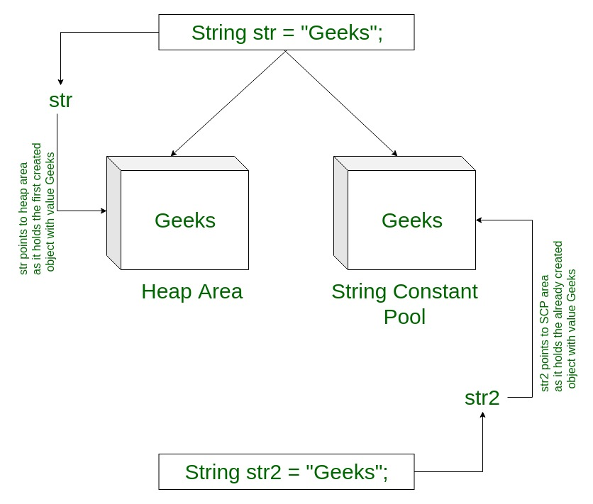

## Interning.

String Interning is a method of storing only one copy of each distinct String Value, which must be immutable.

By applying `String.intern()` on a couple of strings will ensure that all strings having the same contents share the same memory.

> For example, if a name `Amy` appears `100` times, by interning you ensure only one `Amy` is actually allocated memory.



This can be very useful to reduce the memory requirements of your program.
But be aware that the cache is maintained by JVM in permanent memory pool which is usually limited in size compared to heap, so you should not use intern if you don’t have too many duplicate values

`intern()` method : In Java, when we perform any operation using `intern()` method, it returns a canonical representation for the string object.
A pool is managed by String class.

When the `intern()` method is executed then it checks whether the String equals to this String Object is in the pool or not.
If it is available, then the string from the pool is returned. Otherwise, this String object is added to the pool, and a reference to this String object is returned.
It follows that for any two strings s and t, `s.intern()` `==` `t.intern()` is `true` if and only if `s.equals(t)` is true.
It is advised to use `equals()`, not `==`, to compare two strings. This is because `==` operator compares memory locations, while `equals()` method compares the content stored in two objects.

```java
// intern() method  
class GFG {  
    public static void main(String[] args)  
    {  
        // S1 refers to Object in the Heap Area  
        String s1 = new String("GFG"); // Line-1  
  
        // S2 refers to Object in SCP Area 
        String s2 = s1.intern(); // Line-2  
          
        // Comparing memory locations 
        // s1 is in Heap 
        // s2 is in SCP 
        System.out.println(s1 == s2); 
          
        // Comparing only values 
        System.out.println(s1.equals(s2)); 
          
        // S3 refers to Object in the SCP Area  
        String s3 = "GFG"; // Line-3  
  
        System.out.println(s2 == s3);  
    }  }  
 ```

 Output:

`false`

`true`

`true`

**Explanation** : Whenever we create a `String` Object, two objects will be created i.e. One in the Heap Area and One in the `String` constant pool, and the `String` object reference always points to heap area object.

When line-1 execute, it will create two objects and pointing to the heap area created object.

Now when line-2 executes, it will refer to the object which is in the SCP.

Again when line-3 executes, it refers to the same object which is in the SCP area because the content is already available in the SCP area.

No need to create a new one object.


If the corresponding String constant pool(**SCP**) object is not available then `intern()` method itself will create the corresponding **SCP** object.

```java
 class GFG {  
    public static void main(String[] args)  
    {  
        // S1 refers to Object in the Heap Area  
        String s1 = new String("GFG"); // Line-1  
  
        // S2 now refers to Object in SCP Area  
        String s2 = s1.concat("GFG"); // Line-2  
  
        // S3 refers to Object in SCP Area 
        String s3 = s2.intern(); // Line-3  
  
        System.out.println(s2 == s3);  
  
        // S4 refers to Object in the SCP Area  
        String s4 = "GFGGFG"; // Line-4  
  
        System.out.println(s3 == s4);  
    }  } 
   ```

Output:

`true`

`true`

**Explanation** : We use `intern()` method to get the reference of corresponding `SCP` Object.

In this case, when Line-2 executes s2 will have the value **“GFGGFG”** in it only creates one object.
In Line-3, we try to intern s3 which is again with s2 in **SCP** area.

s4 is also in **SCP** so all give output as true when compared.


[media]: https://media.geeksforgeeks.org/wp-content/cdn-uploads/20191106170808/Interning-of-String-in-Java.jpg

[media]: https://media.geeksforgeeks.org/wp-content/cdn-uploads/String-interning-in-Java-1.jpg

[media]: https://media.geeksforgeeks.org/wp-content/cdn-uploads/String-Interning-in-Java-2.jpg