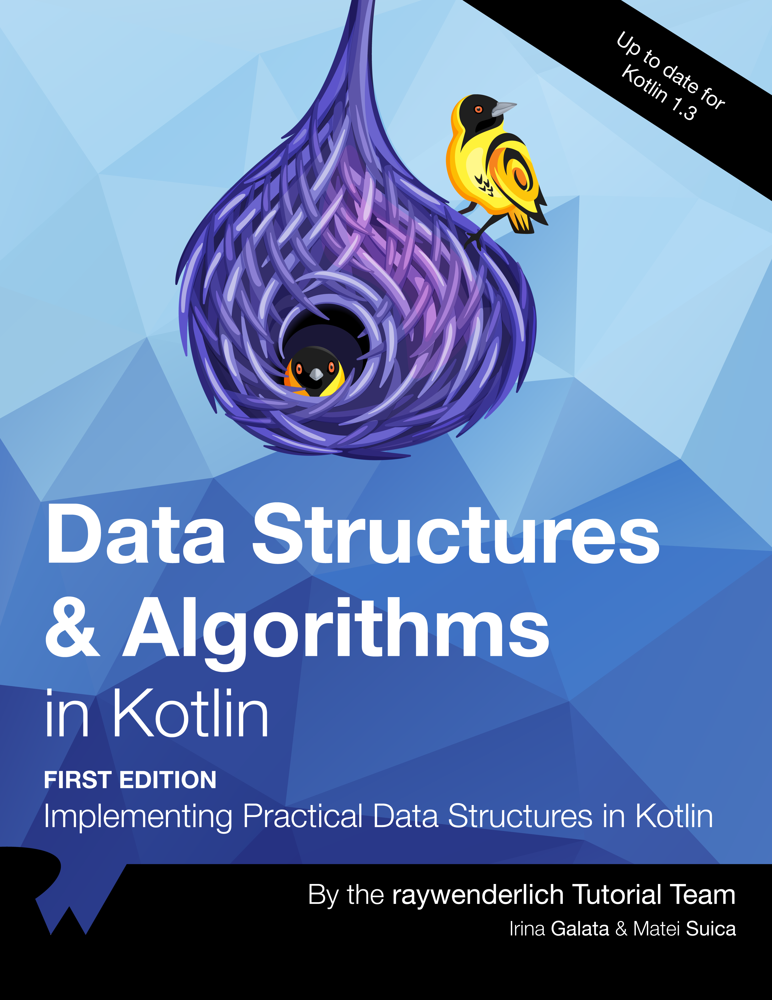

Weaver birds are known for their intricate and sophisticated spherical nests, widely considered some of the most elegant animal-built structures in the world.
Not only are these complex nests 100% waterproof, humans have never figured out how to reproduce these structures on their own.

Weaver birds rely on their elegant weaving techniques to build robust structures, just as you rely on elegant data structures and algorithms to create robust code.
After reading Data Structures & Algorithms in Kotlin, you’ll be able to weave structures and algorithms into your code to make your apps more performant and robust.
Waterproof? Well, that’s a different story!
